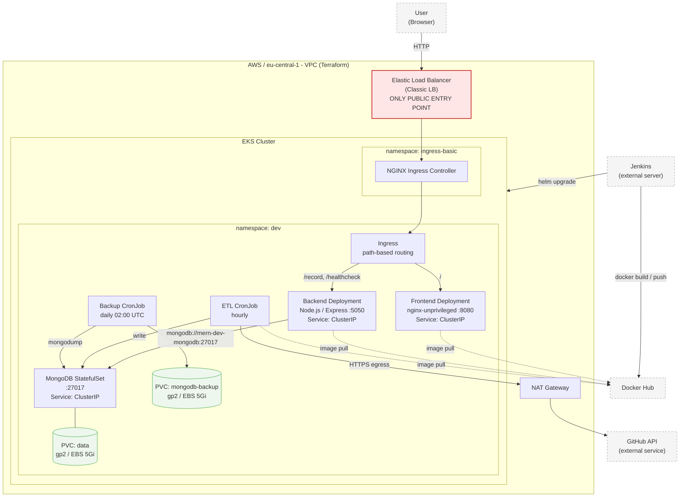

# Mimari Diyagram / Architecture Diagram

Aşağıdaki diyagram Mermaid formatındadır ve bu dosyanın kendisi düzenlenebilir
kaynak dosyasıdır. GitHub üzerinde doğrudan render edilir.

## Sistem bileşenleri ve trafik akışı

## Dış erişim noktaları

| Bileşen | Erişim | Açıklama |
| --- | --- | --- |
| Elastic Load Balancer | **Public** | Kümeye tek giriş noktası. HTTP/80. |
| Frontend Service | ClusterIP | Yalnızca Ingress Controller üzerinden erişilir. |
| Backend Service | ClusterIP | Yalnızca Ingress ve küme içinden erişilir. |
| MongoDB Service | ClusterIP | Küme dışına tamamen kapalı. Yalnızca backend, ETL ve backup CronJob erişir. |
| GitHub API | Giden (egress) | ETL CronJob, NAT Gateway üzerinden dışarı çıkar. |

## İstek akışı

1. Kullanıcı tarayıcıdan ELB adresine HTTP isteği gönderir.
2. ELB trafiği NGINX Ingress Controller pod'larına iletir.
3. Ingress, path-based routing ile `/` isteklerini frontend'e, `/record` ve
   `/healthcheck` isteklerini backend'e yönlendirir.
4. Backend, MongoDB ile ClusterIP Service üzerinden `27017` portundan haberleşir.
5. MongoDB verisi gp2 EBS diski üzerinde PersistentVolumeClaim ile kalıcıdır.
6. ETL CronJob saatte bir GitHub API'sini sorgular ve veriyi MongoDB'ye yazar.
7. Backup CronJob her gece `mongodump` ile ayrı bir PVC'ye yedek alır.
