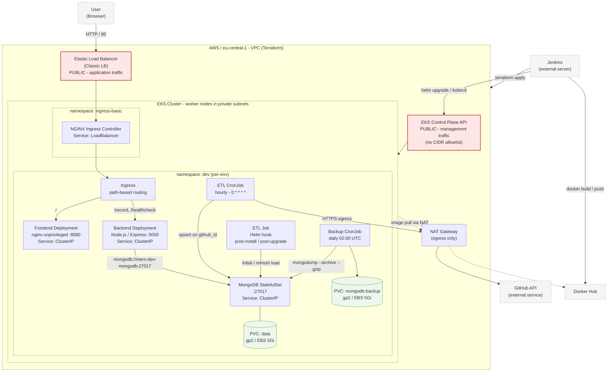

# Mimari Diyagram / Architecture Diagram

Aşağıdaki diyagram Mermaid formatındadır ve bu dosyanın kendisi düzenlenebilir
kaynak dosyasıdır. GitHub üzerinde doğrudan render edilir.

## Sistem bileşenleri ve trafik akışı

## Dış erişim noktaları

| Bileşen | Erişim | Açıklama |
| --- | --- | --- |
| Elastic Load Balancer | **Public** | Uygulama trafiği için kümeye tek giriş noktası. HTTP/80. TLS sonlandırma yapılandırılmamıştır (bkz. kapsam dışı). |
| EKS Control Plane API | **Public** | Yönetim trafiği. `cluster_endpoint_public_access = true`; Jenkins `helm`/`kubectl` çağrılarını buradan yapar. `public_access_cidrs` ile kısıtlanmamıştır — bilinen teknik borç. |
| Frontend Service | ClusterIP | Yalnızca Ingress Controller üzerinden erişilir. |
| Backend Service | ClusterIP | Yalnızca Ingress ve küme içinden erişilir. |
| MongoDB Service | ClusterIP | Küme dışına tamamen kapalı. Yalnızca backend, ETL ve backup CronJob erişir. Authentication kapalıdır; küme içi erişim NetworkPolicy ile kısıtlanmamıştır. |
| GitHub API | Giden (egress) | ETL CronJob, private subnet'ten NAT Gateway üzerinden dışarı çıkar. |
| Docker Hub | Giden (egress) | Worker node'lar imaj çekerken NAT Gateway üzerinden çıkar. |

## İstek akışı

1. Kullanıcı tarayıcıdan ELB adresine HTTP isteği gönderir.
2. ELB trafiği `ingress-basic` namespace'indeki NGINX Ingress Controller pod'larına iletir.
3. Ingress, path-based routing ile `/` isteklerini frontend'e, `/record` ve
   `/healthcheck` isteklerini backend'e yönlendirir.
4. Backend, MongoDB ile ClusterIP Service üzerinden `27017` portundan haberleşir
   (`ATLAS_URI` ortam değişkeni, Helm release adından türetilir).
5. MongoDB verisi, StatefulSet'in `volumeClaimTemplates` bloğu ile gp2 EBS diski
   üzerinde PersistentVolumeClaim olarak kalıcıdır.
6. ETL CronJob saatte bir GitHub API'sini sorgular ve veriyi `github_id` alanı
   üzerinden upsert ederek MongoDB'ye yazar. Kurulum ve her upgrade sonrasında
   aynı iş, Helm `post-install,post-upgrade` hook Job'u ile bir kez daha koşar.
7. Backup CronJob her gece 02:00 UTC'de `mongodump` ile ayrı bir PVC'ye yedek alır.

## Dağıtım akışı

1. Jenkins `Parallel Build & Push` aşamasında frontend, backend ve ETL imajlarını
   eşzamanlı derleyip `v1.0.<BUILD_NUMBER>` etiketiyle Docker Hub'a push eder.
2. `terraform apply` ile seçilen ortamın (`ENV_NAME` → `TF_VAR_env_prefix`) VPC ve
   EKS cluster'ı sağlanır; state S3 backend'inde şifreli tutulur.
3. `helm upgrade --install --wait --atomic --timeout 10m` ile chart, ortam values
   dosyası ve dinamik imaj etiketleriyle dağıtılır.
4. `kubectl rollout status` smoke testi, ardından ELB üzerinden Cypress E2E testi
   koşulur; E2E başarısız olursa `helm rollback` otomatik devreye girer.

## Diyagramda görünmeyen, bilinçli kapsam dışı bileşenler

Aşağıdakiler mimaride yoktur; gerekçeleri `CASE_SONU_CEVAPLARI.md` Soru 3'tedir:
TLS/ACM sertifikası, NetworkPolicy, HorizontalPodAutoscaler, liveness/readiness
probe'ları, MongoDB Replica Set ve authentication, merkezi log toplama katmanı.
